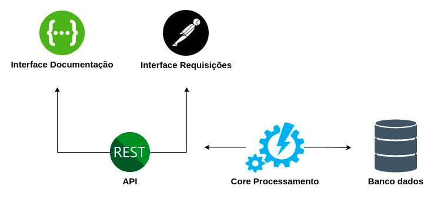
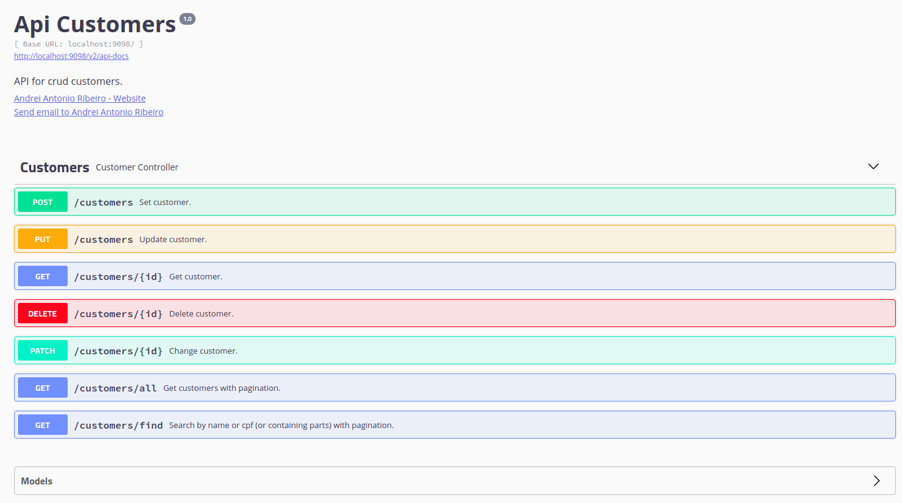

# Api Crud Customers

Este projeto tem como objetivo realizar o CRUD de clientes.

O serviço é executado com SpringBoot e conta com endpoint's RestFull, testes de integração com MockMvc, persistência de dados com JPA, e documentação de api com Swagger.

O projeto esta conteinerizado com imagem do banco Postgres e da api.

#### 1) Formas de execução do sistema e testes de integração.

   ##### Executar com Docker-Compose 
   ><code>sudo docker-compose up</code>

   ##### Executar testes integração 
   ><code>mvn test</code>

#### 2) Arquitetura de funcionamento do sistema.

#### 3) Interface de documentação
><code> http://localhost:9098/swagger-ui.html#/</code>

#### 4) Interface de requisições
><code>[PostmanCollection.json](Customers.postman_collection.json)</code>
